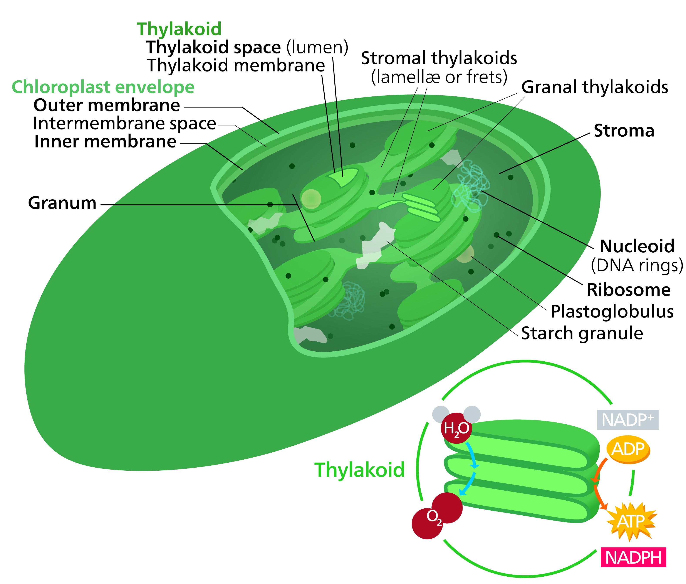
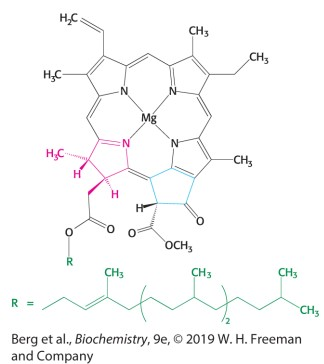
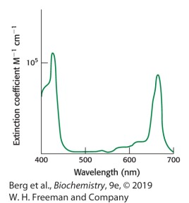
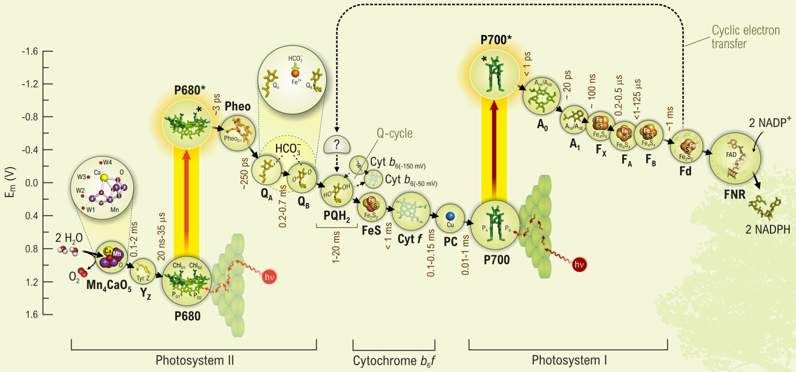
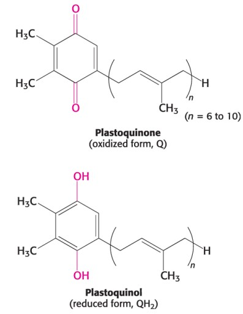
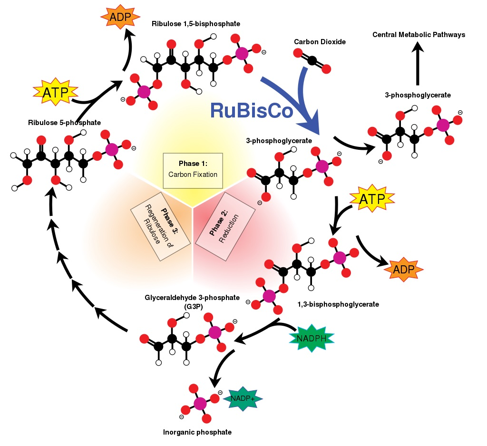
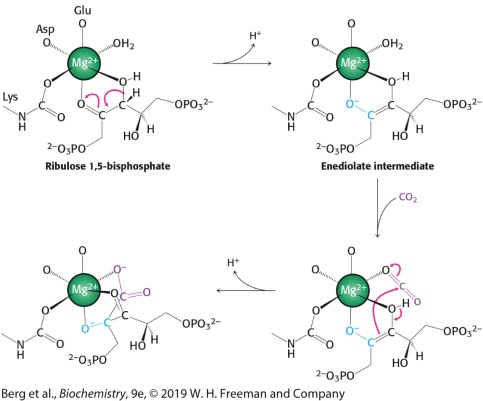
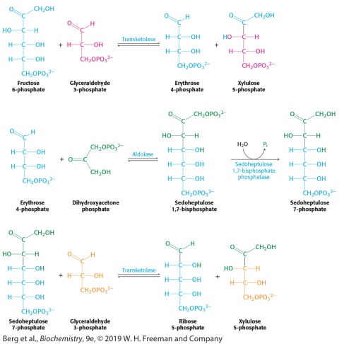
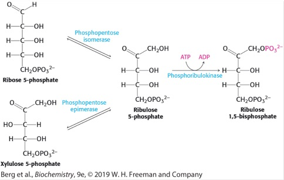

# Photosynthesis

Photosynthesis is the primary energy-storing process by plants, algae and cyanobacteria. The process convert light energy into chemical energy through a series of biochemical reactions.

A general equation for photosynthesis, as first proposed by Cornelis van Niel, can be written as:<br>

$$
\underbrace{ CO_2 }_\text{ carbon dioxide } + \underbrace{ 2 \ H_2A }_\text{ hydrogen donor }
\xrightarrow[ (photons) ]{ \text{ light energy } } \
\underbrace{ CH_2O }_\text{ carbohydrate } \ + \ \underbrace{ H_2O }_\text{ water } \ + \ 2 \ A
$$

H<sub>2</sub>A can be H<sub>2</sub>O or any inorganic hydrogen donor such as H<sub>2</sub>S (in this case, A is sulfur). Carbohydrate is synthesized from carbon dioxide and hydrogen freed by splitting the donor.

Since water is used as the hydrogen donor in oxygenic photosynthesis, the equation for this process can be written as:

$$
\underbrace{ 6 \ CO_2 }_\text{ carbon dioxide } + \quad \underbrace{ 12 \ H_2O }_\text{ water } \
\xrightarrow[ (photons) ]{ \text{ light energy } } \
\underbrace{ C_6H_{12}O_6 }_\text{ glucose } \ + \ \underbrace{ 6 \ H_2O }_\text{ water } \ + \ \underbrace{ 6 \ O_2 }_\text{ oxigen }
$$

where C<sub>6</sub>H<sub>12</sub>O<sub>6</sub> is glucose (which is subsequently transformed into other sugars, starches, and cellulose).

By glancing at the equation, carbon dioxide and water are converted into glucose and oxygen. Water is not only a reactant but a product of the reactions.


In plants and algae, photosynthesis occurs in [chloroplasts](https://en.wikipedia.org/wiki/Chloroplast) typically 3 to 10 μm in diameter.

<center>
<br>
Structure of a typical plant's chloroplast
</center>
<h5 style="text-align: center;">Kelvinsong, CC BY 3.0 <https://creativecommons.org/licenses/by/3.0>, via Wikimedia Commons</h5><br>

Chloroplast has three membrane systems: the outer membrane, the inner membrane, and the thylakoid system. Inside the inner membranes, a colorless fluid referred to as stroma makes up much of a chloroplast's volume, and in which many proteins and the thylakoids forming stacks of disks referred to as grana can be found. The thylakoid membrane and the inner membrane are impermeable to most molecules and ions(including H<sup>+</sup>). The outer membrane is highly permeable to small molecules and ions.

The process of photosynthesis is composed of two stages: the light-dependent reactions and enzymatic reactions which are also called the *Calvin cycle*.

## Stage 1. Light-dependent reactions

The equation for the light-dependent reactions in green plants is:

$$
2 \ H_2O + 2 \ NADP^+ + 3 \ ADP + 3 \ P_i
\xrightarrow[ (photons) ]{ \text{ light energy } } \
O_2 + 2 \ H^+ + 2 \ NADPH + 3 \ ATP
$$

In the light-dependent reactions, chlorophyll pigments embedded in thylakoid membranes absorbs energy of light. 

Chlorophylls, which are very effective photoreceptors, are composed of magnesium ion bonds with organic pigments at the center of the structure.

<br>

Chlorophylls absorb light most strongly in the blue portion of the electromagnetic spectrum as well as the red portion. A measure of its ability to absorb light, peak molar extinction coefficient (ɛ), is greater than 10<sup>5</sup> M<sup>−1</sup> cm<sup>−1</sup> for *chlorophyll a*, among the highest found in organic compounds.
 
<br>

In thylakoid membraine of green plants, photosystem II, catalyzed by a redox-active structure that contains four manganese ions and a calcium ion, liberate oxygen as well as hydrogen ions from water. It transfer electron excited by light energy to acceptors through an electron transport chain referred to as Z-scheme.
 

<h5 style="text-align: center;">D. Shevela, L. O. Björn and G. Govindjee (2018), Z-Scheme of Electron Transport in Photosynthesis, doi: 10.13140/RG.2.2.22936.14081</h5><br>

Photosystem II (also called P680 as it absorbs up to 680 nm wavelengths) consists of protein complexes with numerous bound of chlorophylls. It receives excitation energy either by directly absorbing photons or indirectly from other chlorophylls. 
By exciting an electron to a higher energy level, P680* donates an electron to acceptors such as plastoquinone that cycles between an oxidized form (Q) and a reduced form (QH<sub>2</sub>, plastoquinol).

$$
Q \ + \
\underbrace{ 2 \ e^- }_\text{ electron } \ + \
\underbrace{ 2 \ H^+ }_\text{ proton }
\xrightarrow[ ]{ \text{   } } \
QH_2
$$

<br>

By positively charged, P680<sup>+</sup> is highly oxidant (also called as oxidizer or electron acceptor) extracts an electron from water molecules bound at the water-oxidizing complex (WOC), also called the manganese center. 

$$
\underbrace{ 2 \ H_2O }_\text{ water } \
\xrightarrow[ ]{ \text{   } } \
\underbrace{ O_2 }_\text{ oxigen } \ + \
\underbrace{ 4 \ e^- }_\text{ electron } \ + \
\underbrace{ 4 \ H^+ }_\text{ proton }
$$

Electrons flow from photosystem II to photosystem I through the
cytochrome bf complex. This complex catalyzes the transfer of
electrons from plastoquinol (QH<sub>2</sub>) to plastocyanin (Pc), a small, soluble copper protein in the thylakoid lumen. The two protons from plastoquinol are released into the thylakoid lumen.

Two protons that are taken up to reduce Q to QH<sub>2</sub> come from the stroma, and the four protons that are liberated at WOC are released into the lumen. This make a proton gradient across the thylakoid membrane.

Photosystem I absorbing up to 700 nm wavelengths can be positively charged into P700<sup>+</sup> and it captures an electron from Photosystem II. The electron is transferred to ferredoxin, Fd, a soluble protein containing a 2Fe–2S cluster. The electron is eventually used for reduction of NADP<sup>+</sup> to [NADPH](./doc/NADPH.md) catalyzed by ferredoxin–NADP<sup>+</sup> reductase which transfers two electrons and a proton to NADP<sup>+</sup> to form NADPH. Since a proton is taken up from the stroma during the formation of NADPH, the proton gradient across the thylakoid membrane is increased further.

The proton gradient across the thylakoid membrane is about 3.5 pH units, which corresponds to a proton-motive force of 0.20 V or a ΔG of −20.0 kJ/mol (Biochemistry by Lubert Stryer).

ATP synthase of chloroplasts referred to as CF<sub>1</sub> − CF<sub>0</sub> complex catalyzes the formation of [ATP](./doc/ATP.md) from ADP and Pi.

<br>

### Stage 2. Calvin cycle

The Calvin cycle is a series of biochemical reactions that convert carbon dioxide and hydrogen doner(usually H<sub>2</sub>O) into glucose, as elucidated in the early 1950s by Melvin Calvin, Andrew Benson, and James Bassham. This temperature-sensitive enaymatic reactions occurs in chloroplast's stroma that contains water-soluble enzymes called RuBisCO(ribulose 1, 5-bisphosphate carboxylase/oxygenase).


There are three stages: 

1. The fixation of CO<sub>2</sub> by ribulose 1,5-bisphosphate (RuBP) to form two molecules of 3-phosphoglycerate
2. The reduction of 3-phosphoglycerate to form hexose
3. The regeneration of ribulose 1,5-bisphosphate

<br>

<h5 style="text-align: center;">Overview of the Calvin cycle pathway. Black is carbon; White is hydrogen; Red is oxygen; Pink is phosphorus. Original work by Mike Jones.</h5><br>

 The first step in the Calvin cycle is the process called CO<sub>2</sub> assimilation or CO<sub>2</sub> fixation. The CO<sub>2</sub> molecule is incorporated (fixed) into two molecules of 3-phosphoglycerate by combining with a five-carbon acceptor ribulose-1,5-bisphosphate (RuBP) . This reaction is catalyzed by ribulose 1,5-bisphosphate carboxylase-oxygenase (usually called rubisco).Magnesium ion (Mg<sup>2+</sup>) is needed for enzymatic activity of rubisco.

<br>

In the second stage, ATP and NADPH are used to convert 3-phosphoglycerate molecules into glyceraldehyde-3-phosphate and then into hexoses (fructose 6-phosphate, glucose 1-phosphate and glucose 6-phosphate).

In the third stage, ribulose 1,5-bisphosphate, the acceptor of CO<sub>2</sub> is regenerated by a complex network of reactions.

Formation of five-carbon sugars from six-carbon and three-carbon sugars.

<br>

Regeneration of ribulose 1,5-bisphosphate.

<br>


The net reaction of the Calvin cycle:<br>
$$
6CO_2 + 18ATP + 12NADPH + 12H_2O 
\rightarrow
C_6H_{12}O_6 + 18ADP + 18P_i + 12NADP^+ + 6H^+
$$


The standard Gibbs free energy for this synthesis of glucose is 2,870 kJ/mol,
The Gibbs free energy for converting a mole of CO2 to glucose is 114 kcal (476.976 kJ) 
whereas a mole of photons of 600-nm wavelength has an energy content of [209](./doc/EnergyPhoton.md) kJ/mol. The efficiency of photosynthesis can be estimated from the energy input of 8 moles of photons which lead to nominal efficiency of abt. 30 % (= 477 / (209 x 8) ) (Biochemistry by Stryer, Lubert). In actually, however, an overall photosynthetic efficiency of 3 to 6 % of total solar radiation is considered as the maximum value due to reflection of light, optimal radiation level, valid wavelength range (Renewable biological systems for unsustainable energy production, 1997).


### Stroma
Stroma is the colorless fluid surrounding the grana within the chloroplast.
The series of biochemical redox reactions which take place in the stroma are collectively called the Calvin cycle or light-independent reactions. There are three phases: carbon fixation, reduction reactions, and ribulose 1,5-bisphosphate (RuBP) regeneration.

## Respiration

C<sub>6</sub>H<sub>12</sub>O<sub>6</sub> + 6O<sub>6</sub> &rarr; 6CO<sub>2</sub> + 6H<sub>2</sub>O + 686 kcal


NPK in Plant Biochemistry


Explain the role of nitrogen, phosphorus, and potassium in plants biochemistry.

Nitrogen, phosphorus, and potassium are essential elements for plant growth and development. They are commonly referred to as macronutrients because plants require them in relatively large quantities.

Nitrogen is a key component of amino acids, which are the building blocks of proteins. Proteins are essential for the growth and development of all plant tissues. Nitrogen is also a component of chlorophyll, the molecule that allows plants to photosynthesize and produce their own food.

Phosphorus is a component of nucleic acids, which are the building blocks of DNA and RNA. Phosphorus is also involved in the transfer of energy within plant cells, and it helps to regulate the growth and division of cells.

Potassium is involved in many important plant processes, including the regulation of water balance, the synthesis of proteins, and the activation of enzymes. Potassium is also essential for the proper functioning of the stomata, the tiny openings on the surface of leaves through which plants take in carbon dioxide and release oxygen.

These three elements are typically found in fertilizers and are often labeled with the NPK ratio, which indicates the relative amounts of nitrogen, phosphorus, and potassium in the fertilizer.


```markdown
Syntax highlighted code block

# Header 1
## Header 2
### Header 3

- Bulleted
- List

1. Numbered
2. List

**Bold** and _Italic_ and `Code` text

[Link](url) and 
```

For more details see [Basic writing and formatting syntax](https://docs.github.com/en/github/writing-on-github/getting-started-with-writing-and-formatting-on-github/basic-writing-and-formatting-syntax).

### Jekyll Themes

Your Pages site will use the layout and styles from the Jekyll theme you have selected in your [repository settings](https://github.com/Johann426/Johann426/settings/pages). The name of this theme is saved in the Jekyll `_config.yml` configuration file.

### Support or Contact

Having trouble with Pages? Check out our [documentation](https://docs.github.com/categories/github-pages-basics/) or [contact support](https://support.github.com/contact) and we’ll help you sort it out.

