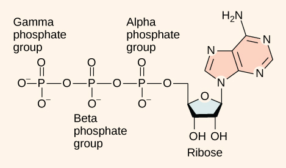
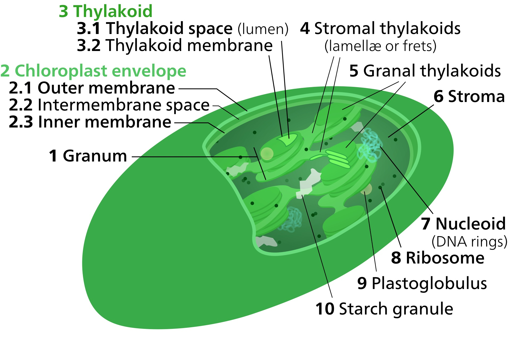

# Plants

## Photosynthesis

Photosynthesis is the primary energy-storing process of plants. The light energy (mostly from sunlight) is stored as chemical energy through a series of biochemical reactions in the chloroplast.

A general equation for photosynthesis, as first proposed by Cornelis van Niel, can be written as:<br>

$$
\underbrace{ 6CO_2 }_\text{ carbon dioxide } + \underbrace{ 12H_2A }_\text{ hydrogen donor }
\rightarrow
\underbrace{ C_6H_{12}O_6 }_\text{ carbohydrate(glucose) } + \underbrace{ 6H_2O }_\text{ water } + 12A
$$

A can be oxygen(O), sulfur(S).

Photosynthesis occurs in two stages. In the light-dependent reactions, chlorophyll absorbs energy of light and use it to make the energy-storage molecules, ATP, and hydrogen carrier, NADPH.

### ATP
Adenosine 5′-triphosphate, abbreviated ATP and usually expressed without the 5′-, is an important energy carrier for biochemical reactions in the cell.



ATP is comprised of the molecule adenosine bound to three phosphate groups. The two bonds between the phosphates are equal high-energy bonds (phosphoanhydride bonds) that, when broken, release sufficient energy to power a variety of cellular reactions and processes. The bond between the beta and gamma phosphate is considered "high-energy" because when the bond breaks, the products [adenosine diphosphate (ADP) and one inorganic phosphate group (Pi)] have a lower free energy than the reactants (ATP and a water molecule).

$$ ATP + H_20 \rightarrow ADP + P_i + energy $$

Like most chemical reactions, the hydrolysis of ATP to ADP is reversible. The reverse reaction combines ADP + Pi to regenerate ATP from ADP. Since ATP hydrolysis releases energy, ATP synthesis must require an input of free energy.

Standard Gibbs energy and Enthalpy changes, ∆G and ∆H, for biochemical reactions (at 298 K, 1 atm, pH 7.0, pMg 3.0, and 0.25 M lonic strength)

$$
ATP + H_2O \rightleftharpoons ADP + P_i \qquad (∆G = −32.48,\ ∆H = −30.88 \ [kJ/mol] )
\\
ADP + H_2O \rightleftharpoons AMP + Pi \qquad (∆G = −32.80,\ ∆H = −28.86 \ [kJ/mol] )
\\
AMP + H_2O \rightleftharpoons adenosine + Pi \qquad (∆G = −13.55,\ ∆H = −1.22 \ [kJ/mol] )
\\
2ADP \rightleftharpoons ATP + AMP \qquad (∆G = −0.31,\ ∆H = +2.02 \ [kJ/mol] )
\\
G6P + H2O \rightleftharpoons Glu + Pi \qquad (∆G = −11.61,\ ∆H = −0.50 \ [kJ/mol] )
\\
ATP + Glu \rightleftharpoons ADP + G6P \qquad (∆G = −20.87,\ ∆H =  −30.39 \ [kJ/mol] )
$$
Data from R. A. Alberty, Arch. Biochem. Biophys. 353, 116 (1998).

 Standard Gibbs energy of one mole of ATP into ADP & Pi is −7.3 kcal/mole (−30.5 kJ/mol). However, this is only true under standard conditions, and the ∆G for the hydrolysis of one mole of ATP in a living cell is almost double the value at standard conditions: 14 kcal/mol (−57 kJ/mol).


### NADPH
reduced nicotinamide adenine dinucleotide phosphate (NADPH)

Temperature-sensitive enaymatic reactions in the stroma use the ATP and NADPH.



### Stroma
Stroma is the colorless fluid surrounding the grana within the chloroplast.
The series of biochemical redox reactions which take place in the stroma are collectively called the Calvin cycle or light-independent reactions. There are three phases: carbon fixation, reduction reactions, and ribulose 1,5-bisphosphate (RuBP) regeneration.

## Respiration

C<sub>6</sub>H<sub>12</sub>O<sub>6</sub> + 6O<sub>6</sub> &rarr; 6CO<sub>2</sub> + 6H<sub>2</sub>O + 686 kcal

```markdown
Syntax highlighted code block

# Header 1
## Header 2
### Header 3

- Bulleted
- List

1. Numbered
2. List

**Bold** and _Italic_ and `Code` text

[Link](url) and 
```

For more details see [Basic writing and formatting syntax](https://docs.github.com/en/github/writing-on-github/getting-started-with-writing-and-formatting-on-github/basic-writing-and-formatting-syntax).

### Jekyll Themes

Your Pages site will use the layout and styles from the Jekyll theme you have selected in your [repository settings](https://github.com/Johann426/Johann426/settings/pages). The name of this theme is saved in the Jekyll `_config.yml` configuration file.

### Support or Contact

Having trouble with Pages? Check out our [documentation](https://docs.github.com/categories/github-pages-basics/) or [contact support](https://support.github.com/contact) and we’ll help you sort it out.
